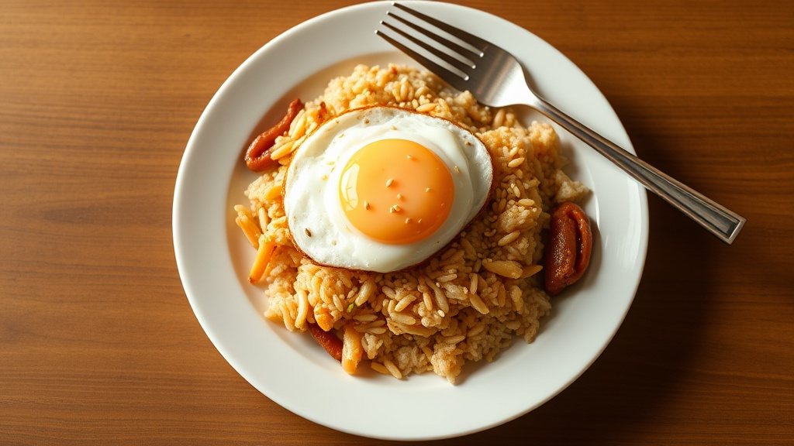

# 오징어 볶음밥

## 재료 (1인분)

| 재료 | 분량 |
|------|------|
| 밥 | 1공기 (200g) |
| 오징어 | 1/2마리 (150g) |
| 양파 | 1/4개 |
| 당근 | 1/4개 |
| 대파 | 1/2대 |
| 계란 | 1개 |
| 고추장 | 1큰술 |
| 고춧가루 | 1/2큰술 |
| 간장 | 1큰술 |
| 설탕 | 1/2작은술 |
| 참기름 | 1작은술 |
| 식용유 | 2큰술 |
| 깨소금 | 약간 |

## 만드는 법

### 1. 재료 손질
- 오징어는 내장을 제거하고 깨끗이 씻은 뒤, 안쪽에 칼집을 넣고 한입 크기로 썬다.
- 양파, 당근은 작은 사각 모양으로 다진다.
- 대파는 송송 썬다.

### 2. 양념장 만들기
- 고추장 1큰술, 고춧가루 1/2큰술, 간장 1큰술, 설탕 1/2작은술을 섞어 양념장을 만든다.

### 3. 오징어 볶기
- 팬에 식용유 1큰술을 두르고 센 불에서 오징어를 30초~1분간 빠르게 볶는다.
- 오징어가 하얗게 익으면 먼저 꺼내둔다. (너무 오래 볶으면 질겨진다)

### 4. 야채 볶기
- 같은 팬에 식용유 1큰술을 추가하고 양파, 당근을 중불에서 2분간 볶는다.

### 5. 볶음밥 완성
- 밥을 넣고 센 불로 올려 잘 풀어가며 볶는다.
- 양념장을 넣고 밥에 골고루 섞이도록 볶는다.
- 볶아둔 오징어를 넣고 함께 1분간 더 볶는다.
- 대파, 참기름을 넣고 마지막으로 30초 볶는다.

### 6. 계란 프라이
- 별도 팬에 계란 프라이를 반숙으로 부친다.

### 7. 플레이팅
- 볶음밥을 접시에 담고 계란 프라이를 올린 뒤 깨소금을 뿌린다.

## 팁
- 오징어는 센 불에서 빠르게 볶아야 질기지 않다.
- 밥은 찬밥을 사용하면 더 잘 볶인다.
- 매운맛을 원하면 청양고추를 추가한다.
- 해물 맛을 더하려면 새우를 함께 넣어도 좋다.
